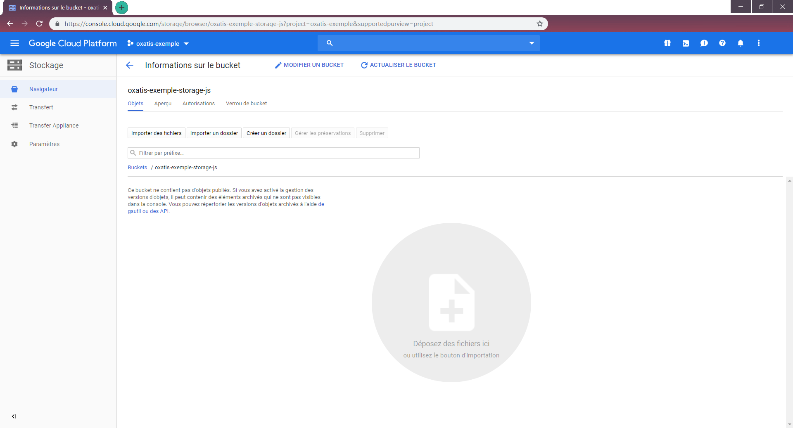

# Utiliser un service de stockage externe
Nous allons voir pas à pas comment heberger ses scripts sur une platforme externe à Oxatis.
Nous verrons Google cloud Storage //et Amazon web service (pas encore)//.

## Google cloud storage
Dans google cloud, vous avez la possibilité de créer une multitude de chose. Nous allons nous interesser à google cloud storage qui est un moyen simple de stocker des fichiers de toute nature.

### Se connecter
Afin d'utiliser google cloud, il est necessaire d'avoir un compte google.
Pour ce faire, rendez vous sur [cloud.google.com](https://cloud.google.com/).

Pour tous les nouveaux inscrits, google offre 300$ de crédit à utiliser pendant 1 an.


Une fois connecté, vous devez accepter les conditions d'utilisation, remplir tous les champs et préciser un moyen de paiement (même si vous disposez d'un essaie gratuit d'une durée de un an, le moyen de paiement doit être précisé).

### Créer un projet
Avant de créer un espace de stockage, il est necessaire de créer un projet.
Pour ce faire, cliquez sur créer un projet (voir image ci-dessous)


Définissez un nom pour votre projet 
**Attention ! Vous ne pourrez pas le modifier**
Et choisissez une "zone" si vous le souhaitez.


Une fois votre projet créé, vous allez alors être redirigé vers le *dashboard* du projet. 


### Créer un bucket

Maintenant que vous avez un prjet, nous allons créer un espace de stockage. Nous le nomerons *bucket*. C'est là où vous mettrez vos fichiers. Pour ce faire, ouvrez le menu de gauche (voir image ci-dessous) et selectionnez "*stockage*" dans le menu.


Une fois dans la page stockage, cliquez sur créer un bucket (voir image ci-dessous).


Après suivez les étapes ci-dessous.
Tout d'abord, donnez un nom à votre bucket. Nous nous servirons de ce nom plus tard.


Choisissez "Multi-regional" et choisissez une zone (de préférence proche de vos clients).


Ensuite, choisissez "Définir des autorisations au niveau de l'objet et du bucket".


Ensuite, ne touchez à rien et laissez les valeurs par défaut.
Cliquez sur "créer" pour créer votre bucket.


Et voila votre bucket de stockage est maintenant créé. Vous pouvez y ajouter des fichiers directement depuis l'interface google cloud mais nous verrons plus tard comment automatisé les accés au bucket.



## Webpack

*description de webpack*

### Installer webpack

Pour installer webpack, referez vous à cette page [webpack.js.org/guides/installation/](https://webpack.js.org/guides/installation/)

Pour utiliser [google cloud storage](https://console.cloud.google.com/storage) avec webpack, vous devez installer le google cloud SDK. Pour ce faire, suivez [ce lien](https://cloud.google.com/sdk/docs/quickstarts), choisissez votre systeme d'exploitation et suivez les instructions.

### Configurer webpack

Pour configurer webpack, je vous ai fait une configuration. Il vous suffit de modifier les variables dans le fichier `vars.js` et d'executer la command `npm install` une fois tous les fichiers mis à la racine de votre *workspace*

#### package.json
```json
{
    "name": "oxatis-test",
    "version": "1.0.0",
    "description": "Package test Oxatis",
    "main": "test.js",
    "scripts": {
        "dev": "webpack --mode=development && node upload.js dev",
        "prod": "webpack --mode=production && node upload.js prod",
    },
    "keywords": [],
    "author": "",
    "license": "ISC",
    "private": true,
    "devDependencies": {
        "@google-cloud/storage": "^3.0.3",
        "autoprefixer": "^9.6.1",
        "cross-env": "^5.2.0",
        "css-hot-loader": "^1.4.4",
        "css-loader": "^3.0.0",
        "html-webpack-plugin": "^3.2.0",
        "node-sass": "^4.12.0",
        "optimize-css-assets-webpack-plugin": "^5.0.3",
        "postcss-loader": "^3.0.0",
        "sass-loader": "^7.1.0",
        "style-loader": "^0.23.1",
        "uglifyjs-webpack-plugin": "^2.1.3",
        "webpack": "^4.35.3",
        "webpack-cli": "^3.3.6",
        "webpack-dev-server": "^3.7.2",
        "webpack-merge": "4.2.1"
    },
    "dependencies": {
        "mini-css-extract-plugin": "^0.8.0"
    }
}
```

#### webpack.config.js :
```javascript
const webpack = require("webpack");
const UglifyJSPlugin = require("uglifyjs-webpack-plugin");
const OptimizeCSSAssets = require("optimize-css-assets-webpack-plugin");
const path = require("path");
const { jsFileProd, jsFileDev, bucketName, entryFile } = require('./vars');

var config = {
    entry: entryFile,
    output: {
        path: path.join(__dirname, "build")
    },
    devServer: {
        contentBase: path.resolve(__dirname, "build"),
        historyApiFallback: true,
        inline: true,
        open: true,
        hot: true
    },
    devtool: "eval-source-map"
};

module.exports = (env, argv) => {

    if (argv.mode === 'development') {
        console.log("Mode development");
        config.output.filename = jsFileDev;
    } else if (argv.mode === 'production') {
        console.log("Mode production");
        config.output.filename = jsFileProd;
        plugins: {
            new UglifyJSPlugin(),
            new OptimizeCSSAssets()
        };
    }

    return config;
};
exports.jsFile;
```

#### upload.js :
```javascript
const { bucketName } = require('./vars');
const { jsFileDev, jsFileProd } = require('./vars');
const { Storage } = require("@google-cloud/storage");
const path = require("path");

let mode = process.argv[2];


async function uploadFile() {
    if (mode === "dev")
        jsFile = jsFileDev;
    else if (mode === "prod")
        jsFile = jsFileProd;
    const storage = new Storage();
    let file = path.join(__dirname, "build", jsFile);
    console.log(`Fichier ${jsFile} en cours de transfert sur le bucket ${bucketName}...`);
    try {
        await storage.bucket(bucketName).upload(file);
        console.log(`Le fichier ${jsFile} a bien été transféré dans le bucket ${bucketName}`);
    } catch (e) {
        console.error(`\tErreur #1 :\n\t\tUne erreur c'est produite lors du transfert du fichier ${jsFile}`);
    }
    try {
        await storage.bucket(bucketName).file(jsFile).makePublic();
        console.log(`Le fichier ${jsFile} est maintenant publique. Il est disponible à l'url : https://storage.cloud.google.com/${bucketName}/${jsFile}`);
    } catch (e) {
        console.error("\tErreur #2 :\n\t\tUne erreur c'est produite lors du rendu publique.");
    }
}

uploadFile();
```

#### vars.js :
```javascript
exports.jsFileProd = 'prod-js.js'; //Le nom de votre fichier de production
exports.jsFileDev = 'dev-js.js'; //Le nom de votre fichier de developpement
exports.bucketName = 'oxatis-test-js'; //Le nom de votre bucket google cloud
exports.entryFile = './test.js'; //le nom de votre fichier javascript principal
```

### Utiliser webpack

Pour utiliser webpack avec le paquet réalisé par mes soins, il vous faut modifier les variables présente dans vars.js avec les valeurs que vous souhaitez.

Les commandes sont les suivantes :

- `npm run dev`
    - Compile et envoie la version de developement au bucket
- `npm run prod`
    - Compile et envoie la version de production au bucket

Une fois envoyé, vos fichiers seront disponible à https://storage.cloud.google.com/{Votre Bucket}/{Votre fichier JS}

Vous pouvez toujours consulter les fichiers présents dans votre bucket depuis la [google cloud console](https://console.cloud.google.com).
